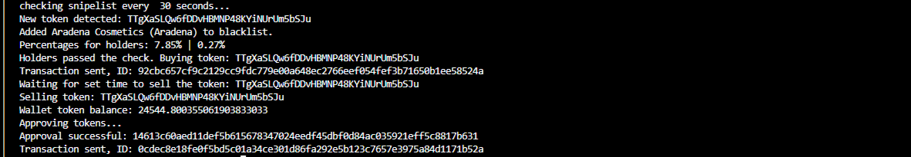
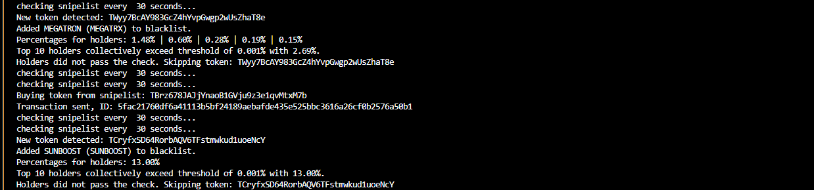
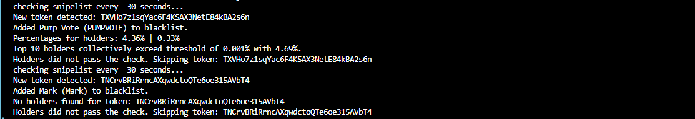

# sunpump-sniper-bot

The `sunpump-sniper-bot` is a tool designed to automate the monitoring, buying, and selling of tokens on the SunPump.Meme platform on the TRON blockchain. It listens for new token creations, evaluates the top holders' percentages,checks for social links, buys tokens if they meet the criteria, and sells them after a specified delay. The bot also manages a snipelist and optionally a blacklist.

## Features

- **Token Detection:** Monitors SunPump.Meme for new token creations.
- **Holders Analysis:** Checks the top 10 holders' percentages to ensure they do not exceed a set threshold.
- **Social Analysis:** Checks for the presence of at least one social links like telegram, X or website.
- **Buying Tokens:** Automatically purchases tokens if they meet the specified criteria.
- **Selling Tokens:** Sells tokens after a configurable delay.
- **Snipelist Management:** Handles tokens listed in `snipelist.txt`, including buying and removing them from the list.
- **Blacklist Management:** Optionally adds tokens to a blacklist and checks against it.
- **Centralized Logging:** Utilizes Winston for logging with configurable levels and transports.

## Prerequisites

Before running the bot, ensure you have:

- **Created a TRON wallet** with sufficient TRX for transactions.

## Installation

1. **Clone the repository:**

    ```bash
    git clone https://github.com/yourusername/sunpump-sniper-bot.git
    ```

2. **Navigate to the project directory:**

    ```bash
    cd sunpump-sniper-bot
    ```

3. **Install dependencies:**

    ```bash
    npm install
    ```

4. **Configure the environment variables:**

   - Rename `.env.example` to `.env` and update it with your details.

5. **Start the bot:**

    ```bash
    node bot.mjs
    ```

## Configuration

### Wallet

- **PRIVATE_KEY**: Your wallet's private key.

### Connection

- **QUICK_NODE**: RPC URL for interacting with the TRON network.

### Snipelist

- **SNIPE_REFRESH_INTERVAL**: Time interval in milliseconds to check and process tokens from the snipelist.

### Holders Filter

- **TOP10_MAX**: Maximum percentage of tokens the top 10 holders can hold.

### Buy Configuration

- **BUY_AMOUNT**: Amount to spend on buying each token (in TRX).
- **FEE_LIMIT**: Gas fee limit for both buy and sell transactions (in TRX).

### Sell Configuration

- **APPROVAL_FEE_LIMIT**: Fee limit to approve tokens before selling (in TRX).
- **SELL_DELAY**: Time delay after buying a token before selling it (in milliseconds).

### Blacklist

- **ADD_TO_BLACKLIST**: Option to add tokens to the blacklist.
- **CHECK_BLACKLIST**: Option to check if a token is in the blacklist.

## Common Issues

- **RPC Node Error:** Indicates issues with the TRON RPC node or network connection.
- **Error Fetching Token Data:** May be due to API rate limits or issues with the TRON network.

## Screenshots

1. **Regular Cycle (Find, Check Holder, Buy, Sell):**

    

2. **Snipe Function:**

    

3. **Whitelist and Blacklist Function:**

    

## Video Demo

[Watch the video demo on YouTube](https://youtu.be/94jDIyTWHQ8?si=uRSY6t1SyeFGLaZt)

## Contact

- **Telegram:** [t.me/+XcOrOHTJ5BNkNDdh](https://t.me/+XcOrOHTJ5BNkNDdh)
